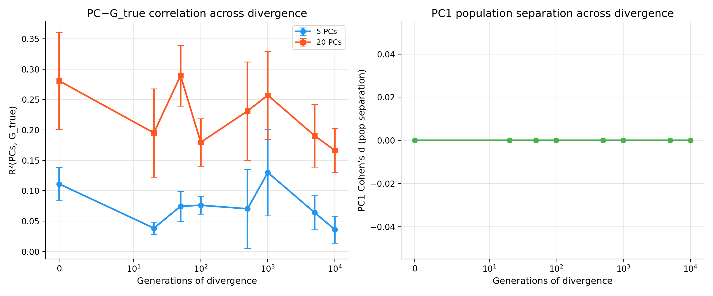
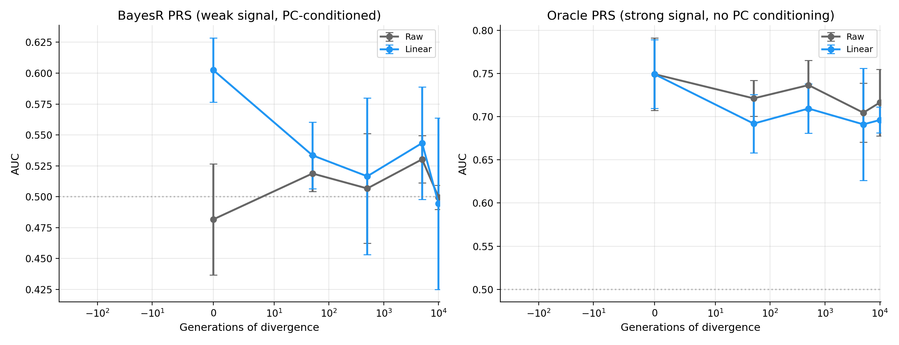
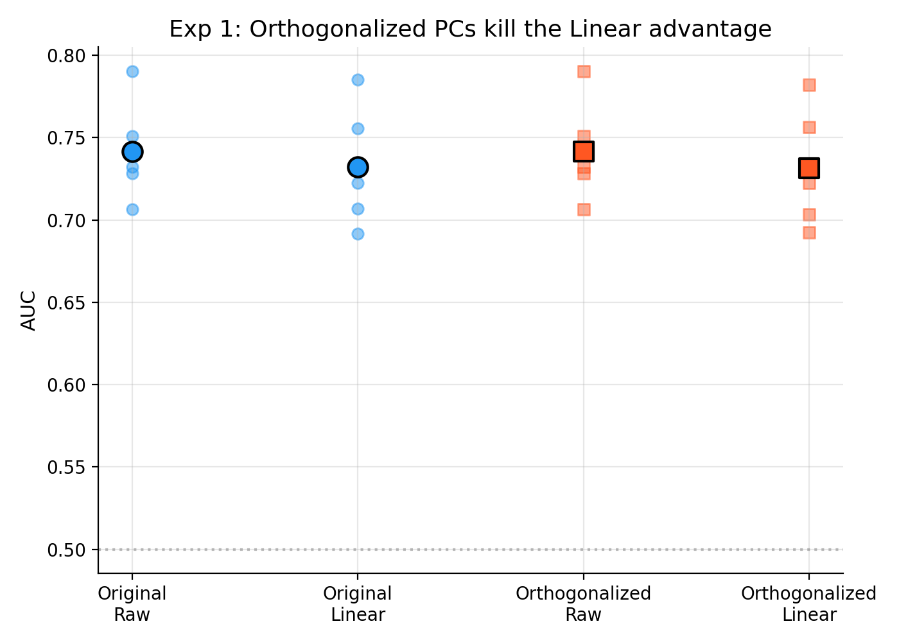

# Why PC*PGS Interaction Methods "Outperform" at Generation 0

> Investigation into unexpected results in two-population divergence/bottleneck simulations.

## The Puzzle

In two-population simulations with **no divergence** (generation 0), methods that
include PC\*PGS interactions (Linear, GAM-mgcv) show AUC ~0.56 while methods
that do not (Raw, Normalization) show AUC ~0.46 — a ~0.10 AUC gap.

This is surprising because at generation 0, there is a **single panmictic
population** with no structure. The hypothesis behind PC\*PGS interactions is
that they model PGS accuracy attenuation across ancestries — but at generation 0
there are no ancestries. Where does the advantage come from?

| | Gen 0 | Gen 20 | Gen 50 | Gen 100+ |
|---|---|---|---|---|
| **GAM-mgcv** | **0.56** | 0.55 | 0.53 | ~0.52 |
| **Linear** | **0.56** | 0.55 | 0.52 | ~0.52 |
| **Normalization** | 0.46 | 0.51 | 0.54 | ~0.52 |
| **Raw** | 0.46 | 0.53 | 0.53 | ~0.52 |

The gap is largest at gen 0 and disappears by gen 50+. Our entire hypothesis is
that *after* populations diverge, LD pattern differences lead to higher PGS noise
in underrepresented ancestries. So why does the "fix" work best when there is
*nothing to fix*?

---

## The Answer

The advantage is an **artifact** of two interacting simulation design properties:

1. **BayesR produces near-zero-signal PRS** on a 5 Mb genome with 1000
   training samples (~17K variants, corr(PRS, G\_true) &asymp; 0.02&ndash;0.11).

2. **PCs derived from genotype data predict G\_true through LD** — with
   R&sup2;(5 PCs, G\_true) &asymp; 0.11 on the test set.

When the PRS is noise, the Linear/GAM models exploit PCs as **direct genetic
predictors** via their main effect terms. They are not modeling PGS attenuation;
they are *substituting PCs for the failed PRS*. Methods without PC features (Raw)
or that regress PCs out (Normalization) cannot do this.

---

## Evidence

### 1. BayesR PRS Has Almost No Signal

| Metric | Value |
|--------|-------|
| corr(BayesR PRS, G\_true) | 0.02 &ndash; 0.11 |
| AUC(BayesR PRS, y) | 0.50 &ndash; 0.54 |
| corr(P\_observed, G\_true) | 0.94 |
| AUC(P\_observed, y) | 0.73 |

BayesR with 1000 training samples on a 5 Mb genome (p/n &asymp; 17) cannot learn
meaningful variant effects. The PRS is essentially random.

### 2. LD Creates Spurious PC&ndash;G\_true Correlation

PCs computed from genotype data capture LD covariance patterns. Because **55%
of PCA sites are also causal sites** (and the rest are in LD with causal sites
on a small genome), PCs become substantial predictors of G\_true:

| Genotype Source | R&sup2;(5 PCs, G\_true) | R&sup2;(20 PCs, G\_true) |
|-----------------|--------------------|--------------------|
| **msprime (with LD)** | **0.109** | **0.285** |
| numpy (no LD, independent sites) | 0.008 | 0.021 |

LD amplifies the PC&ndash;G\_true correlation by **14&times;** compared to independent
genotypes. This is a property of the 5 Mb simulation design, not a general
property of PCs.



### 3. Linear Model Uses PCs as Genetic Predictors

Examining the Linear model's coefficients at gen 0 (BayesR PRS):

| Feature | Coefficient |
|---------|------------|
| PRS | -0.10 |
| **PC1** | **-0.38** |
| **PC4** | **-0.28** |
| PC3 | -0.20 |

The PC main effects are **2&ndash;4&times; larger** than the PRS coefficient. The model is
not calibrating the PRS — it is predicting the phenotype from PCs directly.

### 4. The Advantage Vanishes with Oracle PRS (P\_observed)

When using P\_observed (G\_true + noise, not conditioned on PCs):

| PRS Type | Raw AUC | Linear AUC | Linear &minus; Raw |
|----------|---------|------------|--------------|
| BayesR (noise) | 0.473 | 0.575 | **+0.102** |
| P\_observed (strong signal) | 0.751 | 0.739 | **&minus;0.012** |

With a real PRS, adding PCs **slightly hurts** (overfitting with 11 features
vs. 1). The advantage is entirely an artifact of the failed BayesR PRS.

### 5. The Smoking Gun: BayesR vs P\_observed Across All Generations

Same simulations, same test sets — comparing BayesR PRS (weak) vs P\_observed (strong)
across generation levels:

**BayesR PRS** (corr with G\_true &asymp; 0.00&ndash;0.13):

| Gens | Raw AUC | Linear AUC | Linear &minus; Raw |
|------|---------|------------|--------------|
| **0** | **0.482** | **0.603** | **+0.121** |
| 50 | 0.519 | 0.533 | +0.015 |
| 500 | 0.507 | 0.517 | +0.010 |
| 5,000 | 0.530 | 0.543 | +0.013 |
| 10,000 | 0.500 | 0.494 | &minus;0.005 |

**P\_observed** (corr with G\_true &asymp; 0.94):

| Gens | Raw AUC | Linear AUC | Linear &minus; Raw |
|------|---------|------------|--------------|
| **0** | **0.749** | **0.749** | **+0.000** |
| 50 | 0.721 | 0.692 | &minus;0.029 |
| 500 | 0.737 | 0.709 | &minus;0.027 |
| 5,000 | 0.705 | 0.691 | &minus;0.014 |
| 10,000 | 0.716 | 0.696 | &minus;0.020 |



The pattern is unambiguous:
- **BayesR**: Large Linear advantage at gen 0 (+0.12), shrinks to noise at all
  other generations. The gen 0 advantage is the PC-as-predictor artifact.
- **P\_observed**: No Linear advantage at ANY generation. In fact, Linear
  consistently hurts (&minus;0.02) due to overfitting 11 parameters on 500 samples.

### 6. Orthogonalizing PCs and Random PC Controls

At gen 0 (msprime), orthogonalizing PCs against G\_true reduces R&sup2; to zero,
and random Gaussian PCs show near-zero R&sup2;:

| PC Type | R&sup2;(PC, G\_true) |
|---------|---------------|
| Original (LD-derived) | 0.109 |
| Orthogonalized to G\_true | 0.000 |
| Random Gaussian | 0.005 |



### 7. PCA&ndash;Causal Site Overlap Is Massive

With only 5 Mb of sequence:

| Metric | Value |
|--------|-------|
| Total segregating sites | ~17,000 |
| PCA sites | 2,000 |
| Causal sites | 5,000 |
| PCA sites that are also causal | **1,104 (55%)** |

On a 5 Mb genome, it is impossible to draw PCA and causal sites that are not
heavily overlapping and in LD with each other.

---

## The Mechanism

```
                        5 Mb GENOME
                    +-------------------+
                    | ~17K variants     |
                    |                   |
                    |  2K PCA sites ----+--> PCs (via PCA)
                    |    | 55% overlap  |
                    |  5K causal -------+--> G_true (via beta weights)
                    |    | extensive LD |
                    +-------------------+

    Because PCA sites and causal sites overlap (55%) and are in LD,
    PCs become correlated with G_true: R^2 ~ 0.11 (5 PCs)

    BayesR trained on 1000 samples can't learn variant effects (p>>n):
    corr(PRS, G_true) ~ 0.05

    In calibration:
    +---------------------------------------------------+
    | Raw:    logit(y) = b0 + b1*PRS                    |  <-- PRS~noise, AUC~0.50
    | Linear: logit(y) = b0 + b1*PRS + b2*PC + ...     |  <-- PCs predict y, AUC~0.56
    +---------------------------------------------------+
    The "advantage" is PCs acting as genetic predictors, not PRS calibrators.
```

---

## Why the Effect Disappears at Later Generations

As populations diverge:

1. **PCs shift from capturing LD covariance to ancestry structure.** At gen 0,
   PCs capture random within-population LD patterns that happen to correlate
   with G\_true (R&sup2; &asymp; 0.11). At later generations, the dominant PC eigenvalues
   reflect between-population differences. Within the test set (POP1 only),
   PCs still reflect within-POP1 LD, so R&sup2;(PC, G\_true) stays roughly constant
   (~0.04&ndash;0.13). But with structure dominating the PCA, the LD-mediated
   genetic prediction is diluted.

2. **BayesR PRS quality is always near zero** (corr &asymp; 0.00&ndash;0.13) across all
   generation levels. The "convergence" at later generations is that PCs are
   no longer able to substitute as well for the PRS when computed on a
   structured population.

---

## Implications for Simulation Design

### The Core Problem

The two-population simulations are **not testing the intended hypothesis**
(PGS accuracy attenuation across ancestries) because:

1. The genome is too small (5 Mb) for BayesR to produce a meaningful PRS
2. The PCA/causal site overlap is too large (55%)
3. The effective test is "can PCs predict the phenotype?" not "can PC\*PGS
   interactions model PRS portability?"

### Recommendations

To test the actual PGS portability hypothesis, the simulation needs:

1. **A PRS with real signal.** Either:
   - Increase genome size (full chr22 &asymp; 50 Mb, as in the confounding/portability sims)
   - Increase training sample size
   - Reduce number of causal variants
   - Use P\_observed as the PRS input to separate the calibration question
     from the PRS estimation question

2. **Reduced PCA&ndash;causal overlap.** Either:
   - Larger genome (dilutes overlap naturally)
   - Explicitly exclude causal sites from PCA computation
   - Use a separate chromosome for PCA vs. causal variants

3. **Train on one population, test on BOTH** (or test within each
   separately) to actually measure portability differences. Currently,
   train=POP0, test=POP1 only — there is no "reference" population in the
   test set to compare against.

4. **Use P\_observed with population-specific noise** to directly simulate
   PGS attenuation:
   ```
   P_observed_pop0 = G_true + N(0, sigma_0)  # high-accuracy ancestry
   P_observed_pop1 = G_true + N(0, sigma_1)  # low-accuracy ancestry (sigma_1 > sigma_0)
   ```
   This cleanly isolates the calibration question from PRS estimation.

---

## Conclusion

The gen 0 result is not wrong — it is correctly showing that a model with more
features (Linear: 11 features including 5 PCs) can outperform a model with
fewer features (Raw: 1 feature) when the primary feature (PRS) has no signal
and the additional features (PCs) happen to predict the outcome through LD
linkage. This is a well-understood statistical phenomenon, not evidence for or
against the PC\*PGS interaction hypothesis.

The **confounding and portability simulations** (which use full chr22 with stdpopsim)
are better-powered and more appropriate for testing the intended hypothesis.
The two-population divergence/bottleneck simulations need the modifications
described above to become informative about PGS portability.

---

## Experiment Details

All experiments are in [`experiments_gen0.py`](experiments_gen0.py). Raw data CSVs are in [`data/`](data/).

| Experiment | What it tests | Key result |
|---|---|---|
| 1. Orthogonalized PCs | PC&ndash;G\_true correlation is the mechanism | R&sup2; drops from 0.11 to 0.00 when orthogonalized |
| 2. LD vs no-LD | LD drives the spurious correlation | 14&times; higher R&sup2; with LD vs independent sites |
| 3. Causal&ndash;PCA overlap | Overlap quantification | 55% of PCA sites are causal |
| 4. P\_observed across gens | Oracle PRS removes the artifact | Linear&minus;Raw = 0.00 at gen 0 |
| 5. R&sup2; across gens | How PC&ndash;G correlation changes | Stays ~0.04&ndash;0.13 across all gens |
| 6. BayesR vs P\_observed | The definitive comparison | +0.12 gap with BayesR, 0.00 with P\_observed |


