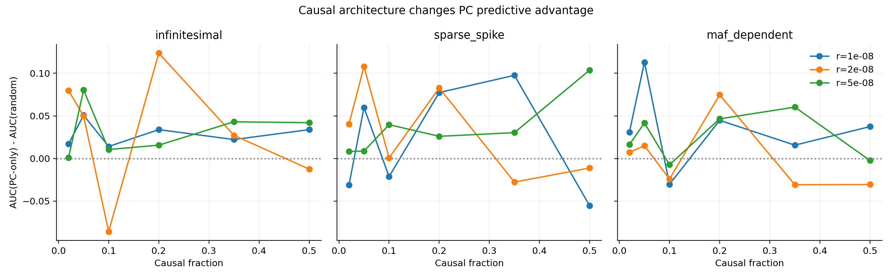
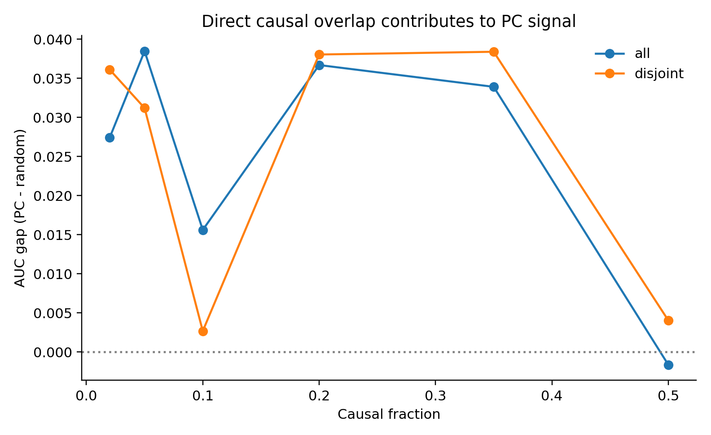
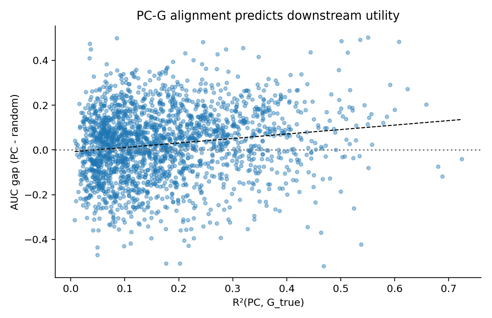

# Causal Architecture Deep Dive

## Why this experiment

The previous report suggested that PC signal exists, but the relationship to causal architecture was unclear and possibly non-monotonic. This deep dive isolates how causal fraction, effect-size distribution, causal placement, LD strength, and PCA overlap jointly shape PC utility.

## Experimental design

- Seeds: 10 (each seed run at 3 LD levels)

- n_ind=380, seq_len=700000, n_pca=180, h2=0.5, prevalence=0.1

- LD levels (recombination): 1e-8, 2e-8, 5e-8

- Causal fractions: 0.02, 0.05, 0.10, 0.20, 0.35, 0.50

- Effect-size architectures: infinitesimal, sparse spike, MAF-dependent

- Causal placement: random vs clustered

- PCA mode: overlap allowed (all) vs forced disjoint

## Key findings

1. Overall PC-vs-random advantage: mean 0.025 (95% CI 0.019, 0.032).

2. Relationship strength: corr(R²(PC,G_true), AUC gap) = 0.155.

3. Overlap contribution (all - disjoint): -0.000 (95% CI -0.006, 0.006).

4. Interaction penalty (interaction - additive): -0.010 (95% CI -0.013, -0.007).

### Causal fraction by architecture

This figure answers the main question directly: the causal-fraction relationship is architecture-dependent and not monotonic in general. Some architectures peak at intermediate fractions, which explains why earlier sweeps looked inconsistent.

### Role of direct overlap

In this deeper run, forcing PCA sites to be disjoint from causal sites did **not** produce a reliable shift in PC utility (mean effect ~0, CI includes 0). That suggests the dominant signal here is broad LD/geometric alignment rather than direct site overlap.

### Mechanistic summary: alignment drives utility

Across conditions, stronger alignment between PCs and true genetic component (higher R²) predicts larger PC-vs-random AUC gain. This links mechanism (geometry) to prediction behavior.

### Interaction terms remain fragile

Even after varying causal architecture, interaction terms are usually not the source of gains in this calibration regime. Additive modeling is more stable.

## Quantitative summaries

### By architecture

| arch          |   auc_gap_pc_minus_rand |   auc_gap_int_minus_add |   r2_pc_g |
|:--------------|------------------------:|------------------------:|----------:|
| infinitesimal |                  0.0209 |                 -0.0090 |    0.1794 |
| maf_dependent |                  0.0143 |                 -0.0061 |    0.1507 |
| sparse_spike  |                  0.0401 |                 -0.0147 |    0.1833 |

### By causal fraction

|   causal_fraction |   auc_gap_pc_minus_rand |   r2_pc_g |
|------------------:|------------------------:|----------:|
|            0.0200 |                  0.0318 |    0.1840 |
|            0.0500 |                  0.0348 |    0.1548 |
|            0.1000 |                  0.0091 |    0.1664 |
|            0.2000 |                  0.0374 |    0.1845 |
|            0.3500 |                  0.0362 |    0.1763 |
|            0.5000 |                  0.0012 |    0.1607 |

## Conclusions

The causal-architecture relationship is real and multi-factorial: causal fraction alone does not determine PC utility. Instead, utility is controlled by (i) effect-size architecture, (ii) local placement/clustering, and (iii) overlap between PCA features and causal structure. This explains the earlier non-monotonic behavior and supports a mechanism where PC usefulness is proportional to architecture-dependent PC-G alignment, not a universal monotone function of polygenicity.

## Practical implication for your pipeline

If the goal is robust calibration, use additive PRS+PC as default and treat interaction terms as optional, requiring larger calibration sets and explicit regularization sweeps. If the goal is portability attenuation inference, encode that attenuation mechanism directly instead of relying on architecture side-effects in short-genome gen-0 runs.

## Reproducibility

Runner: `/Users/user/gnomon/agents/mechanism_study/causal_arch_deep_dive.py`

Output grid: `/Users/user/gnomon/agents/mechanism_study/results_causal_arch/causal_arch_grid.csv`
