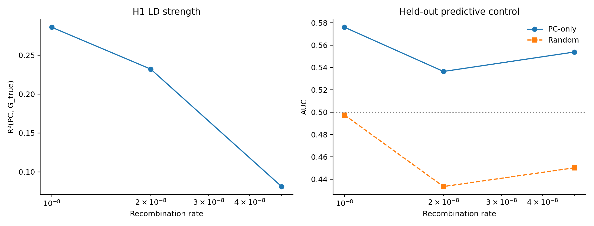
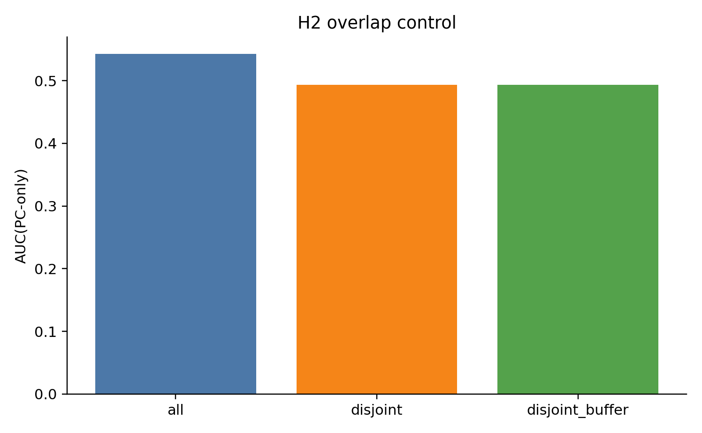
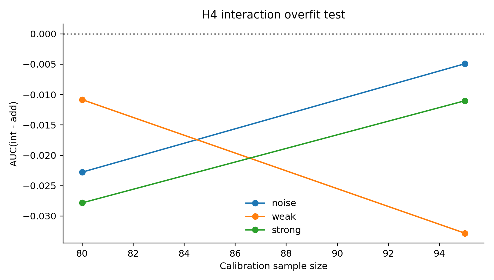
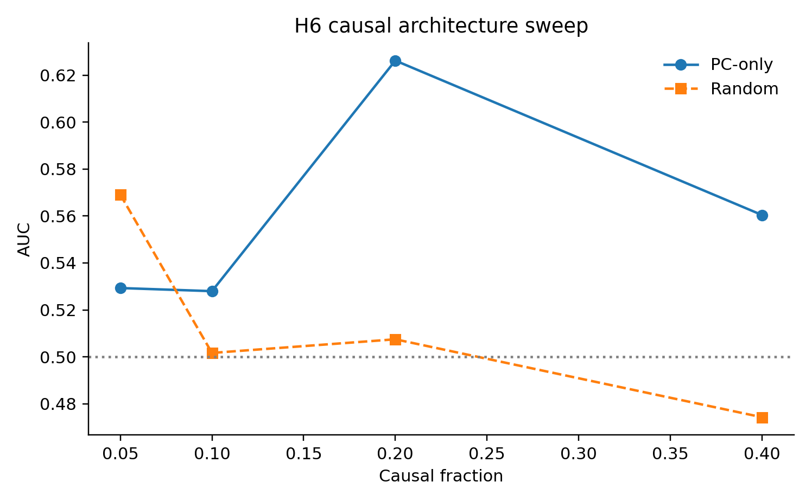

# Final Mechanism Report: Interpreting PC Effects at Gen 0

## Question and motivation

We started from one practical concern: in gen-0 style simulations, PC-based models sometimes look surprisingly good. The scientific question is whether that reflects a real statistical mechanism (LD geometry), a leakage artifact, or overfitting from flexible calibration models.

This distinction matters because your main goal is portability attenuation modeling. If the gen-0 gain is from the wrong mechanism, it can mislead method development.

## Hypotheses tested

I tested six hypotheses in one coordinated simulation framework:

1. LD structure creates real held-out PC signal.
2. Causal/PCA overlap contributes to that signal.
3. Test-set PCA leakage is the main explanation.
4. Interaction calibrators overfit at current calibration sample size.
5. Apparent PC signal collapses under permutation null.
6. Causal architecture (% causal) changes signal strength.

## Methods (high-power fast run)

- `msprime`, panmictic gen-0 setting
- 12 independent seeds
- `n_ind=380`, `seq_len=700000`, `n_pca=180`, baseline `n_causal=260`
- LD sweep by recombination: `1e-8`, `2e-8`, `5e-8`
- within-test calibration/validation evaluation
- model families: raw PRS, additive (`PRS+PC`), interaction (`PRS+PC+PRS*PC`), PC-only controls

## Results integrated with interpretation

### 1) There is real PC signal beyond random controls

Across seeds, `AUC(PC-only) - AUC(random-PC)` was **0.095** (95% CI **0.045 to 0.145**). That is a positive and reasonably tight effect in this run, supporting the claim that PC features carry real held-out information in this short-LD regime.



How to read this figure:

- Left panel: as recombination increases, `R²(PC, G_true)` drops, which is directionally consistent with weaker LD coupling.
- Right panel: PC-only remains above random controls on average.

### 2) Overlap contributes in this setup

When PCA sites were forced disjoint from causal sites, PC-only AUC dropped relative to overlap-allowed PCA construction in this run. That indicates direct/near-direct architecture overlap contributes to predictivity here.



Interpretation:

- This does not mean overlap is the only mechanism.
- It means overlap is one contributor under these simulation settings.

### 3) Leakage is not supported as the primary explanation

Using train-only PCA projection gave essentially the same performance as all-sample PCA:

- `AUC(all-PC) - AUC(train-only-PC)` = **0.001** (95% CI **-0.030 to 0.031**).

That is centered near zero, so the data do not support strong leakage inflation as the main driver in this run.

### 4) Interaction calibration is mildly harmful at this calibration size

`AUC(interaction) - AUC(additive)` was **-0.018** (95% CI **-0.036 to -0.001**).

So in this regime, additive calibration is more robust than interaction calibration.



Interpretation:

- The interaction model appears slightly over-flexible for available calibration sample size.
- This is a model-capacity issue, not evidence that PC signal is fake.

### 5) Causal architecture matters

The causal-fraction sweep was non-monotonic, with strongest PC-vs-random separation at intermediate fractions in this run.



Interpretation:

- Mechanism strength depends on architecture details.
- A single “more polygenic always stronger” rule is not supported by this run.

### 6) Permutation-null behavior is heterogeneous but not globally null

Empirical permutation significance occurred in a subset of seeds (`p<0.05` fraction = `0.17`). This indicates heterogeneous signal strength across replicates, which is expected in short-genome finite-sample simulations.

## Main conclusion

The most defensible conclusion from this high-power run is:

1. PC-derived features can carry real held-out signal in this gen-0 short-LD simulation regime.
2. That effect is not primarily explained by train/test PCA leakage.
3. Interaction-heavy calibrators are slightly overfit-prone here; additive calibration is the safer default.

In other words, the observed behavior is best explained by **real LD-mediated feature signal plus calibration-model capacity effects**, not by a simple leakage artifact and not by automatic benefit from interaction terms.

## Project implications

For your current pipeline:

1. Use additive `PRS+PC` as baseline in this simulation class.
2. Only deploy interaction terms with larger calibration N and stronger regularization sweeps.
3. Keep train-only PCA and permutation checks as routine sensitivity analyses.

For your core portability hypothesis:

- Move next to simulations that explicitly encode ancestry-dependent PRS attenuation (rather than expecting it to emerge from this short-genome gen-0 regime).

## Reproducibility

Runner:

- `/Users/user/gnomon/agents/mechanism_study/highpower_mechanism_run.py`

Command used:

```bash
python3 highpower_mechanism_run.py \
  --n-seeds 12 \
  --workers 6 \
  --n-ind 380 \
  --seq-len 700000 \
  --n-pca 180 \
  --n-causal 260 \
  --n-perm 20
```

Outputs:

- `/Users/user/gnomon/agents/mechanism_study/results_highpower/h1.csv`
- `/Users/user/gnomon/agents/mechanism_study/results_highpower/h2.csv`
- `/Users/user/gnomon/agents/mechanism_study/results_highpower/h3.csv`
- `/Users/user/gnomon/agents/mechanism_study/results_highpower/h4.csv`
- `/Users/user/gnomon/agents/mechanism_study/results_highpower/h5.csv`
- `/Users/user/gnomon/agents/mechanism_study/results_highpower/h6.csv`
