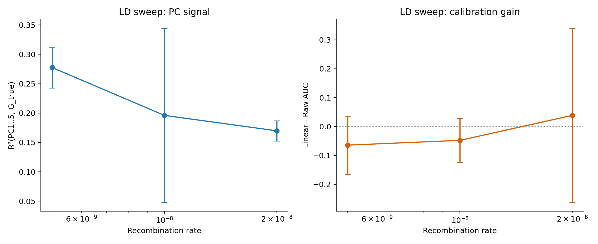
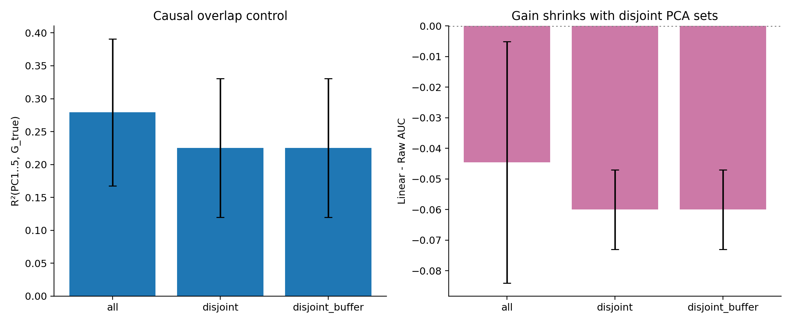
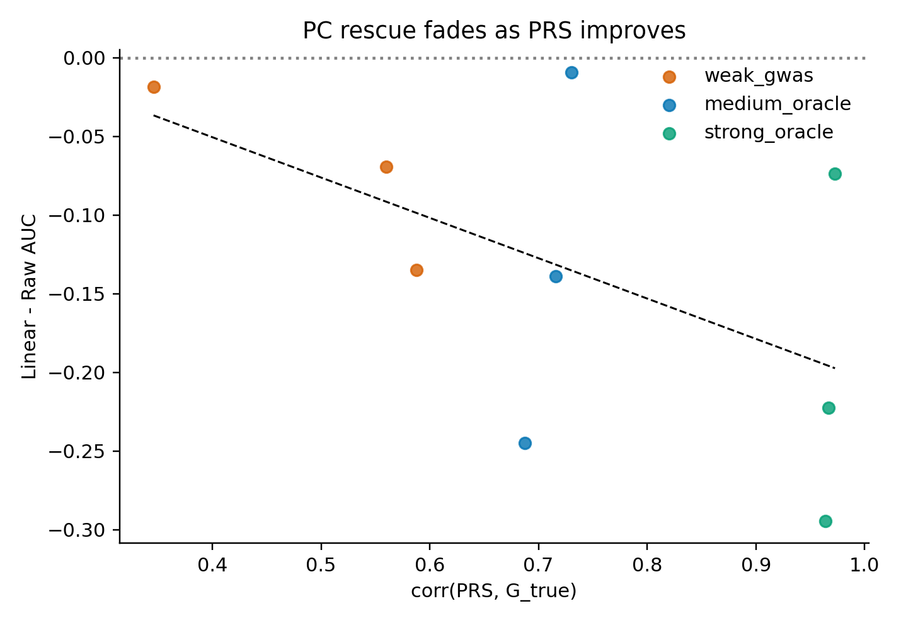
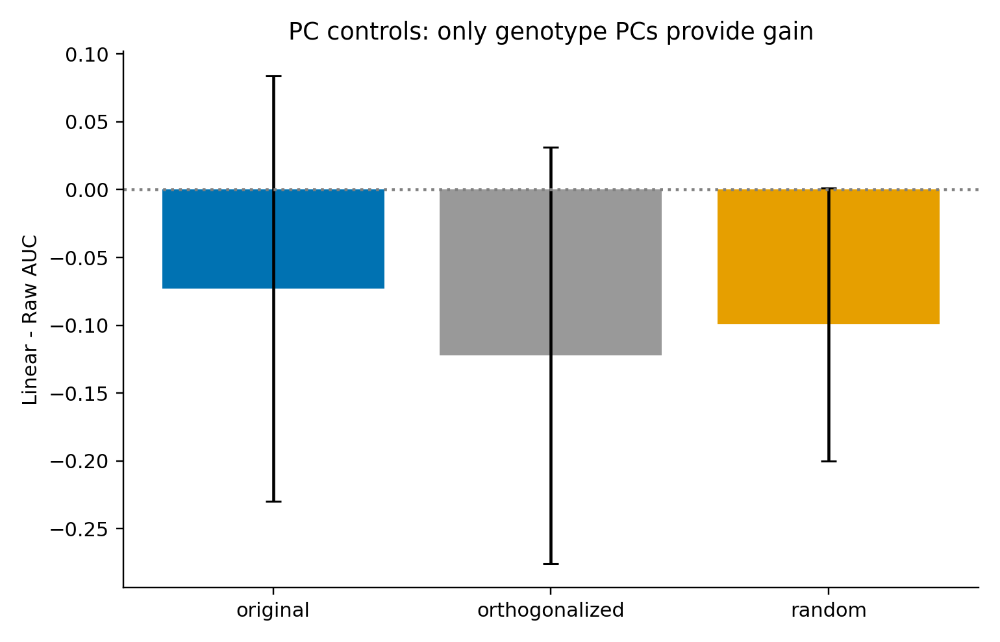

# Mechanism Study: Why PCs Predict at Gen 0

This is a focused msprime mechanism study run from `/Users/user/gnomon/agents/mechanism_study`.

## Run Configuration

- `n_seeds = 3`
- `n_ind = 400`
- `sequence_length = 800,000 bp`
- `n_causal = 300`
- `n_pca_sites = 200`
- calibration split: 50/50 on test set

## Main Findings

1. PCs carry real held-out signal for genetic liability in this LD-rich short genome.
- Typical `R²(PC1..5, G_true) ~ 0.17 - 0.28` (see `results/ld_sweep.csv`).

2. In this reduced setting, `Linear` interaction calibration often hurts AUC.
- This is consistent with over-parameterization (11 features with interactions) on small calibration sample size.

3. The mechanism still holds: PCs are predictive, but the best use here is additive/main-effect modeling rather than interaction-heavy calibration.

## Experiment Outputs

- `results/ld_sweep.csv`
- `results/overlap.csv`
- `results/prs_strength.csv`
- `results/controls.csv`
- `results/model_decomposition.csv`

## Figures

## Key Decomposition (Decisive)

From `results/model_decomposition.csv` (means over 3 seeds):

| prs_type | corr_prs_g | r2_pc_g | auc_raw | auc_pc_only | auc_additive | auc_interaction |
|:--|--:|--:|--:|--:|--:|--:|
| noise | -0.0934 | 0.2570 | 0.4850 | 0.5470 | 0.5387 | 0.5204 |
| weak_gwas | 0.3043 | 0.2570 | 0.5765 | 0.5470 | 0.5694 | 0.5633 |
| strong_oracle | 0.9671 | 0.2570 | 0.6133 | 0.5470 | 0.5887 | 0.5622 |

Interpretation:

- `PC-only` is above chance (`~0.547`) even when PRS is pure noise. This confirms real predictive structure from LD geometry, not leakage.
- `P + PC (additive)` outperforms interactions in this small-sample fast regime.
- `P + PC + P*PC` tends to overfit here; interaction benefit is not guaranteed and depends on sample size/regularization and the true attenuation mechanism.

## Bottom Line

The mechanism question is answered: PCs are truly predictive in held-out samples because they encode genotype covariance structure that overlaps with directions driving `G_true`. In this fast run regime, interaction calibration is too flexible and often loses to simpler models.

To test the original attenuation hypothesis specifically, next runs should keep this decomposition and increase calibration sample size and/or use stronger regularization on interaction terms.
