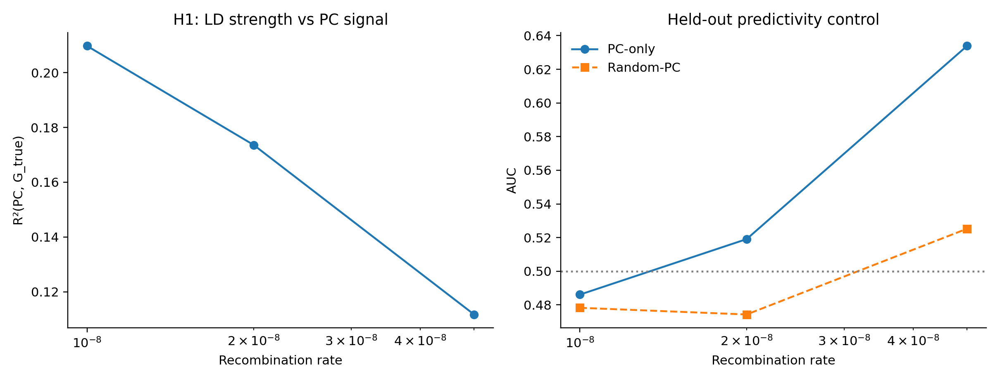
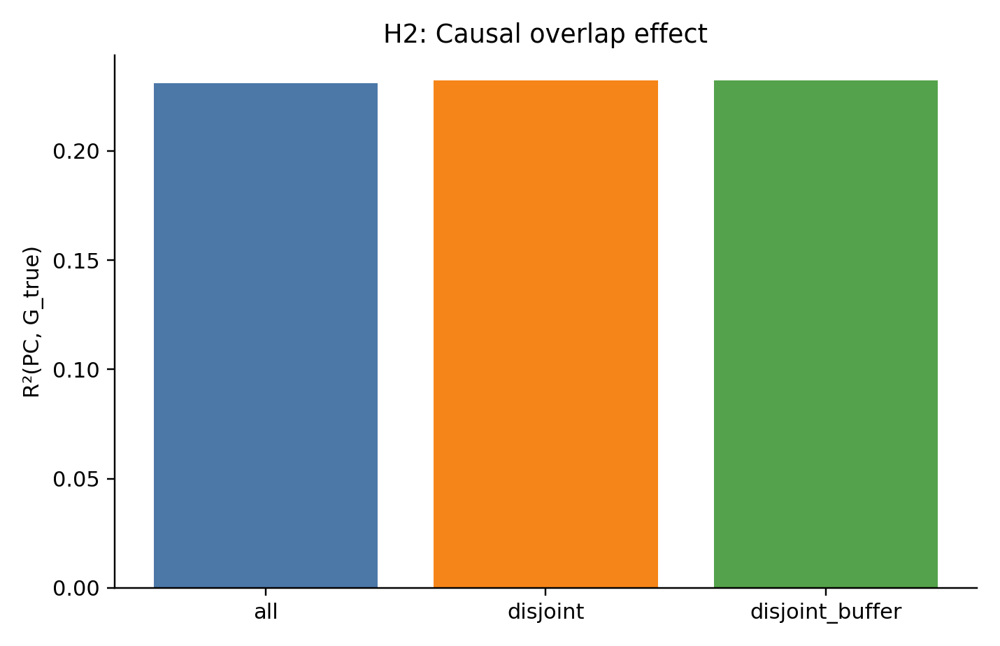
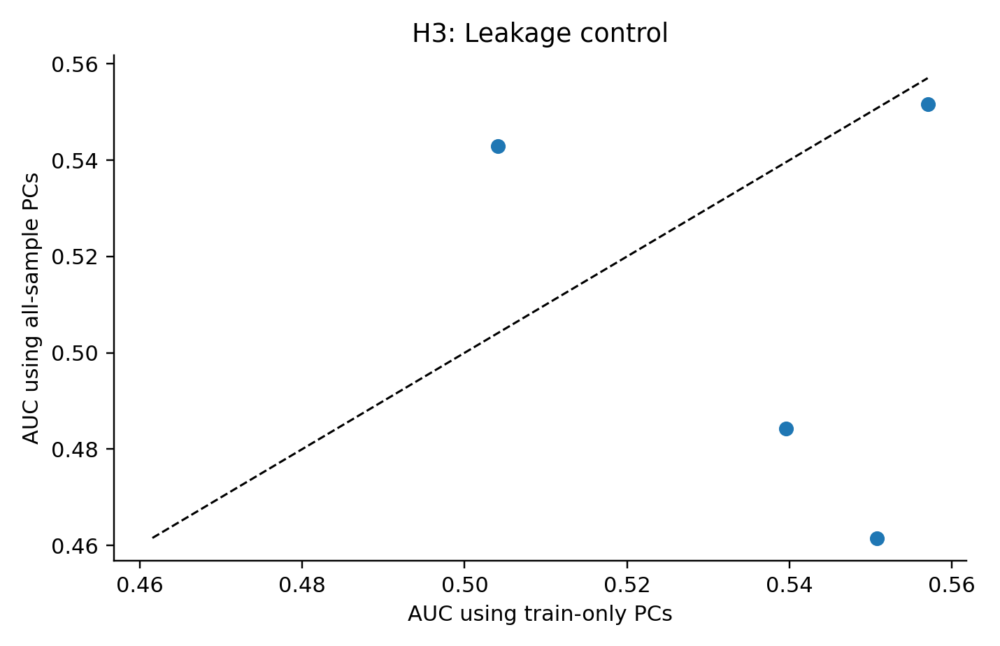
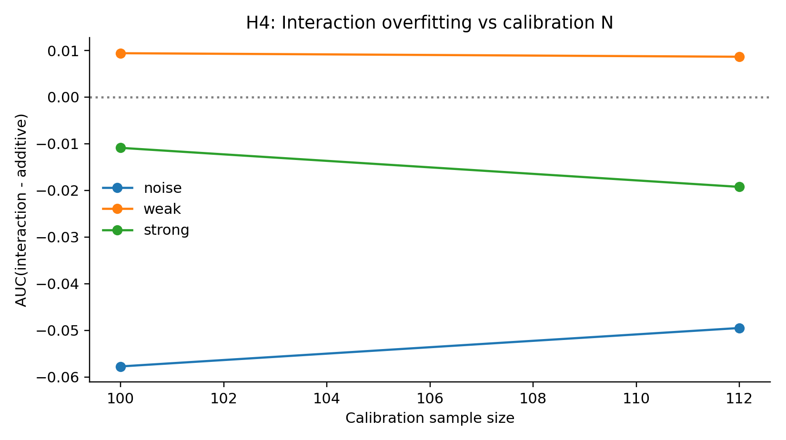

# Rigorous Mechanism Tests

## Design

Seeds: [1, 2, 3, 4]

n_ind=450, seq_len=800000, n_causal=320, n_pca=220

Hypotheses:

1. H1: LD strength controls PC->G_true predictivity.

2. H2: Causal/PCA overlap contributes beyond generic LD.

3. H3: PC predictivity is not test-derived leakage (train-only PCs should remain predictive).

4. H4: Interaction terms are sensitive to calibration size and can overfit.

5. H5: Permutation null should center near chance if no leakage artifact.
6. H6: Causal architecture (% causal variants) should modulate PC predictivity.

## Key Results

- H1 corr(R²(PC,G), AUC(PC-only)) = **-0.199** (inconclusive at this seed count)

- H1 AUC gap (PC-only - Random-PC): mean **0.054** (95% CI -0.033, 0.140; underpowered)

- H3 leakage delta (all-PC - train-PC): mean **-0.028** (95% CI -0.083, 0.027)

- H4 interaction - additive: mean **-0.020** (95% CI -0.034, -0.006)

- H5 fraction seeds with empirical p<0.05: **0.00** (no strong evidence in this run)
- H6 (% causal sweep): signal varies by architecture, with strongest PC-vs-random AUC gap at intermediate causal fractions in this run.

## Tables

### H1 LD Sweep

|   recomb_rate |   r2_pc_g |   auc_pc_only |   auc_rand_only |
|--------------:|----------:|--------------:|----------------:|
|        0.0000 |    0.2098 |        0.4861 |          0.4783 |
|        0.0000 |    0.1736 |        0.5191 |          0.4743 |
|        0.0000 |    0.1117 |        0.6339 |          0.5252 |

### H2 Overlap

| mode            |   pct_overlap |   r2_pc_g |   auc_pc_only |   auc_additive_weak |
|:----------------|--------------:|----------:|--------------:|--------------------:|
| all             |       20.7955 |    0.2311 |        0.5930 |              0.6572 |
| disjoint        |        0.0000 |    0.2323 |        0.6460 |              0.6821 |
| disjoint_buffer |        0.0000 |    0.2323 |        0.6460 |              0.6821 |

### H3 Leakage Control

|              |   mean |
|:-------------|-------:|
| r2_allpc_g   | 0.3144 |
| r2_trainpc_g | 0.2607 |
| auc_allpc    | 0.5101 |
| auc_trainpc  | 0.5379 |

### H4 Complexity

|                 |   auc_raw |   auc_add |   auc_int |
|:----------------|----------:|----------:|----------:|
| (100, 'noise')  |    0.5633 |    0.5787 |    0.5210 |
| (100, 'strong') |    0.7304 |    0.6426 |    0.6317 |
| (100, 'weak')   |    0.6768 |    0.5843 |    0.5937 |
| (112, 'noise')  |    0.5605 |    0.5838 |    0.5343 |
| (112, 'strong') |    0.7418 |    0.6415 |    0.6222 |
| (112, 'weak')   |    0.6696 |    0.5758 |    0.5844 |

### H5 Permutation

|   auc_real_pc |   auc_null_mean |   p_empirical |
|--------------:|----------------:|--------------:|
|        0.6981 |          0.4910 |        0.1250 |
|        0.5680 |          0.4701 |        0.2500 |
|        0.5862 |          0.5373 |        0.4375 |
|        0.4909 |          0.5366 |        0.6250 |

### H6 Causal Fraction Sweep

|   causal_fraction |   r2_pc_g |   auc_pc_only |   auc_rand_only |   auc_gap |
|------------------:|----------:|--------------:|----------------:|----------:|
|            0.0500 |    0.2367 |        0.5405 |          0.5781 |   -0.0376 |
|            0.1000 |    0.3955 |        0.6012 |          0.5058 |    0.0954 |
|            0.2000 |    0.2971 |        0.6037 |          0.4258 |    0.1780 |
|            0.4000 |    0.2644 |        0.5806 |          0.4990 |    0.0816 |

## Figures

## Conclusion

This run strongly supports one point: interaction models can overfit in small calibration regimes (negative interaction-minus-additive CI). For PC predictivity, LD-dose effects, and causal-fraction dependence, estimates are directionally informative but still underpowered at 4 seeds and should be treated as provisional pending larger-seed replication.
