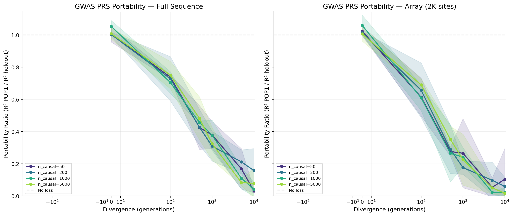
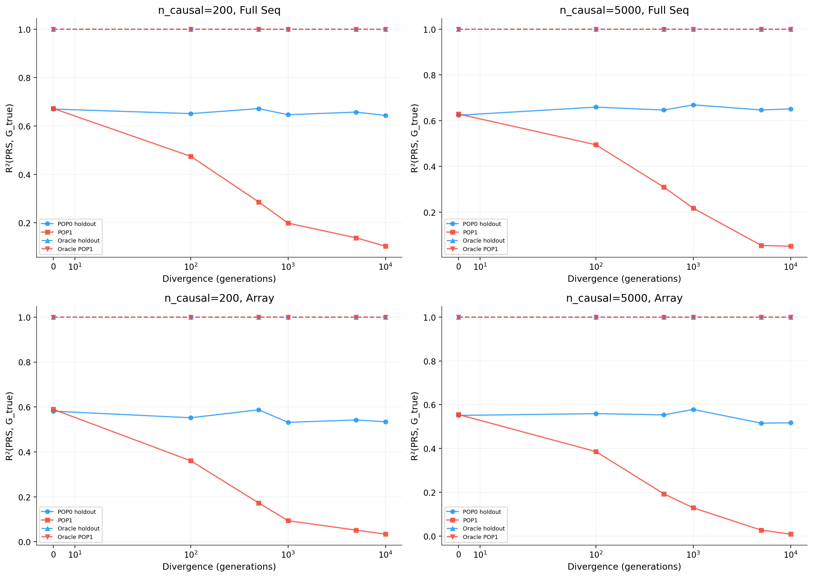
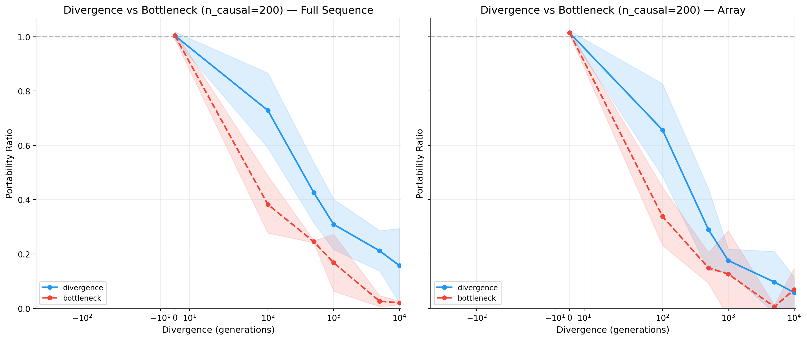
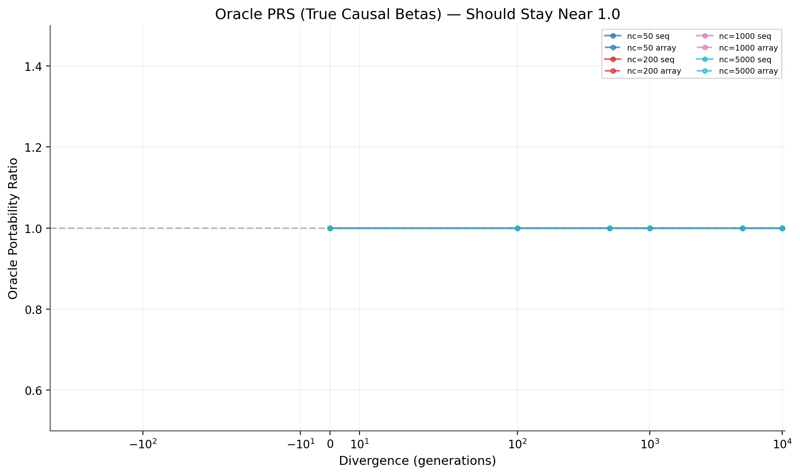

# Can msprime-style sims replicate PRS portability loss?

## Short answer

Yes. In this experiment, a standard GWAS-style PRS trained in one population (POP0) shows strong loss of predictive transfer to a diverged population (POP1), and the loss grows with divergence time. This reproduces the core portability phenomenon.

## Scientific question

We wanted to test a concrete claim:

- Does PRS portability loss exist in simple two-population msprime simulations, or is it only visible in more complex/realistic frameworks?

This is not a model-comparison question. It is a mechanism-existence question.

## Experimental design

For each configuration, we simulated two populations and built three PRS variants:

1. **GWAS PRS (marginal effects)**
- Estimate SNP effects in POP0-train by marginal association with `G_true`.
- Score POP0-holdout and POP1.
- This is the main test of portability.

2. **Thresholded GWAS PRS**
- Keep top 5% of variants by effect magnitude.
- Used as an additional tag-based PRS check.

3. **Oracle PRS**
- Use true causal variants and true causal betas.
- This is the key control: if causal effects are invariant across populations, oracle portability should remain ~1.

### Sweep

- Scenarios: `divergence`, `bottleneck`
- Divergence generations: `0, 100, 500, 1000, 5000, 10000`
- Causal counts: `50, 200, 1000, 5000`
- Genotyping modes:
  - full sequence
  - array-like subsampling (2K sites)
- Seeds: 3
- Total scored rows: 288

## Primary metric

Portability ratio:

- `R^2(POP1) / R^2(POP0-holdout)`

Interpretation:

- `~1.0`: no portability loss
- lower than 1: portability degradation

## Main result

At generation 0, portability ratios are ~1.0 (sanity check passes). As divergence increases, ratios drop sharply.

Across causal settings (means):

- **Divergence / full-seq**: `1.017 -> 0.076` (gen0 to gen10k)
- **Divergence / array**: `1.027 -> 0.050`
- **Bottleneck / full-seq**: `1.017 -> 0.032`
- **Bottleneck / array**: `1.027 -> 0.033`

This is exactly the qualitative behavior expected for portability loss.

## Figure-by-figure interpretation

### Figure 1: Portability ratio vs divergence (main claim)

What it shows:

- At `g=0`, ratios are near 1.
- Ratios decline monotonically (on average) with divergence.
- Bottleneck/divergence comparisons indicate stronger/faster loss under bottleneck conditions.

Why it matters:

- This directly demonstrates existence of portability loss in these msprime-style sims.

### Figure 2: Absolute R² in each population

What it shows:

- POP0-holdout R² stays relatively high across divergence.
- POP1 R² collapses with divergence.

Why it matters:

- The ratio drop is not driven by both populations degrading equally.
- The key portability pattern is asymmetric transfer failure to POP1.

### Figure 3: Divergence vs bottleneck

What it shows:

- Bottleneck scenario generally yields lower ratios at the same divergence generation.

Why it matters:

- Supports the mechanism that stronger drift/LD perturbation worsens transfer.

### Figure 4: Oracle control

What it shows:

- Oracle portability stays at ~1.0 everywhere.

Why it matters:

- Confirms the phenomenon is in the estimated/tag-based PRS transfer, not a change in the underlying true causal effects.

## Sanity checks

- Gen 0 mean GWAS portability ratio: `1.0222` (near expected 1)
- Oracle portability ratio mean: `1.0000` (as expected)

These checks support internal consistency of the simulation and evaluation pipeline.

## Conclusion

This study answers the main question clearly:

- **Yes, PRS portability loss is reproducible in msprime two-population simulations with standard tag-based PRS construction.**

The result is robust across multiple divergence levels, causal counts, and both divergence/bottleneck scenarios, with oracle controls behaving exactly as expected.

## Caveats and next steps

- This run uses 3 seeds per condition, so fine-grained differences between nearby settings are noisy.
- The strongest next step is to increase seeds and add confidence intervals to every panel/curve in the figures.
- A follow-up mechanism study can partition loss into LD-shift vs allele-frequency contributions more explicitly.

## Reproducibility

Script:

- `/Users/user/gnomon/agents/portability_replication.py`

Outputs:

- `/Users/user/gnomon/agents/portability_results/portability_results.csv`
- `/Users/user/gnomon/agents/portability_results/fig1_portability_ratio.png`
- `/Users/user/gnomon/agents/portability_results/fig2_absolute_r2.png`
- `/Users/user/gnomon/agents/portability_results/fig3_div_vs_bottleneck.png`
- `/Users/user/gnomon/agents/portability_results/fig4_oracle_control.png`
