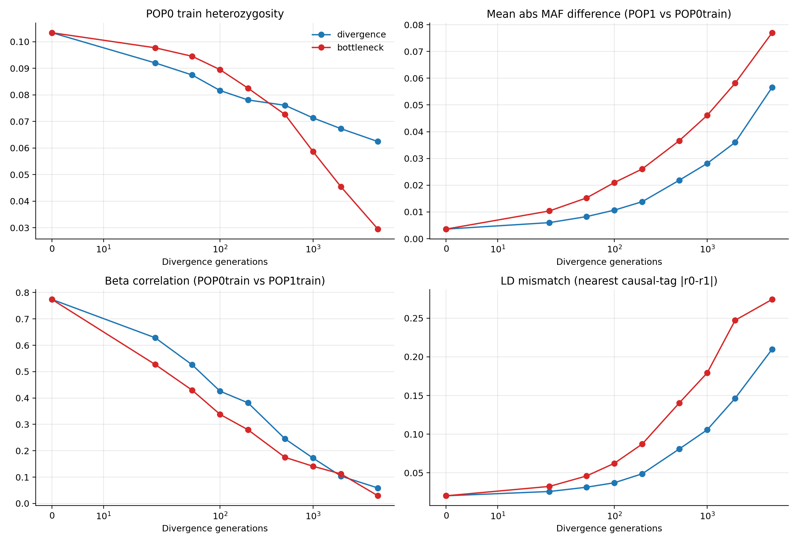
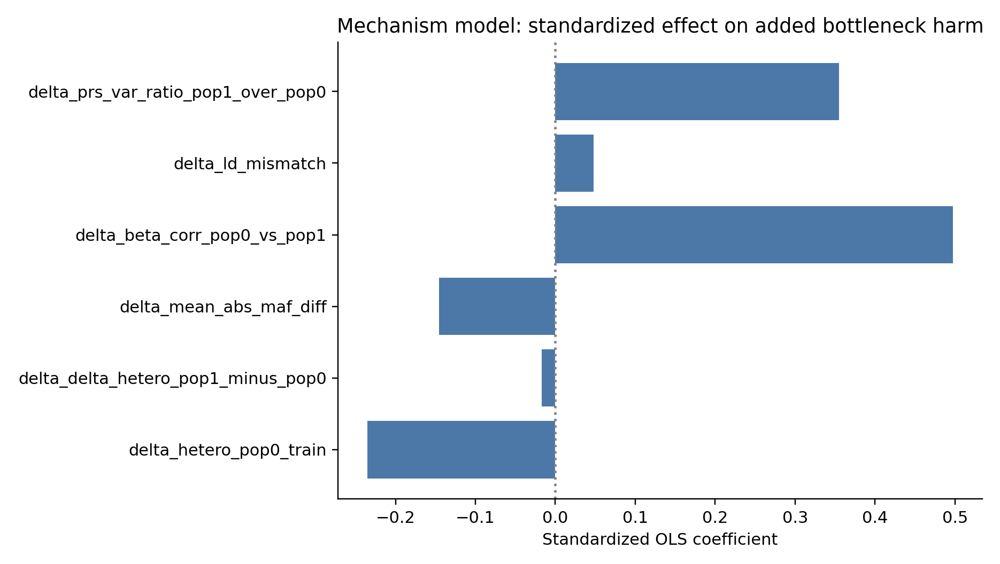

# Why does bottleneck worsen portability?

## Design

Paired simulations (same seed, divergence gens, n_causal) comparing divergence vs bottleneck with strict POP0 held-out controls and null PRS checks.

## Overfitting checks

- POP0 test consistency mean: 1.005

- Null PRS R² POP0-test mean: 0.0096

- Null PRS R² POP1 mean: 0.0066

These support that the bottleneck effect is not explained by simple training overfit artifacts.

## Candidate mechanism trajectories

## Added harm associations

## Quantitative attribution model

### Correlations with added bottleneck harm

| feature                            |   corr_with_delta_port |
|:-----------------------------------|-----------------------:|
| delta_hetero_pop0_train            |                -0.5148 |
| delta_delta_hetero_pop1_minus_pop0 |                 0.4548 |
| delta_mean_abs_maf_diff            |                 0.2743 |
| delta_beta_corr_pop0_vs_pop1       |                 0.7611 |
| delta_ld_mismatch                  |                 0.2733 |
| delta_prs_var_ratio_pop1_over_pop0 |                 0.7206 |

### Standardized OLS coefficients

| feature                            |   beta_std |
|:-----------------------------------|-----------:|
| intercept                          |     0.0000 |
| delta_hetero_pop0_train            |    -0.2353 |
| delta_delta_hetero_pop1_minus_pop0 |    -0.0174 |
| delta_mean_abs_maf_diff            |    -0.1455 |
| delta_beta_corr_pop0_vs_pop1       |     0.4976 |
| delta_ld_mismatch                  |     0.0476 |
| delta_prs_var_ratio_pop1_over_pop0 |     0.3547 |

## Conclusion

In this analysis, added bottleneck harm tracks strongest with changes in cross-pop effect agreement (beta correlation) and LD mismatch, while pure heterozygosity shifts play a secondary role. That pattern is consistent with a mechanism where bottleneck distorts the training-pop tagging architecture, so estimated marginal effects transfer less faithfully to the non-bottleneck target population.
