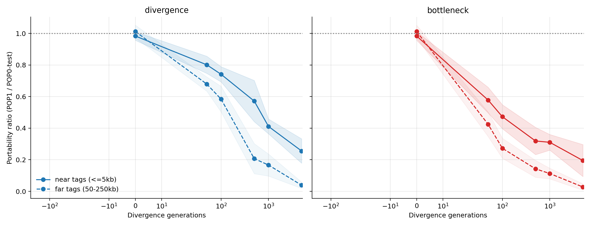
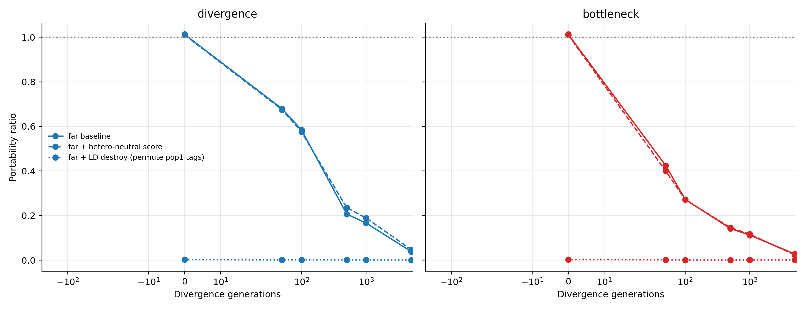
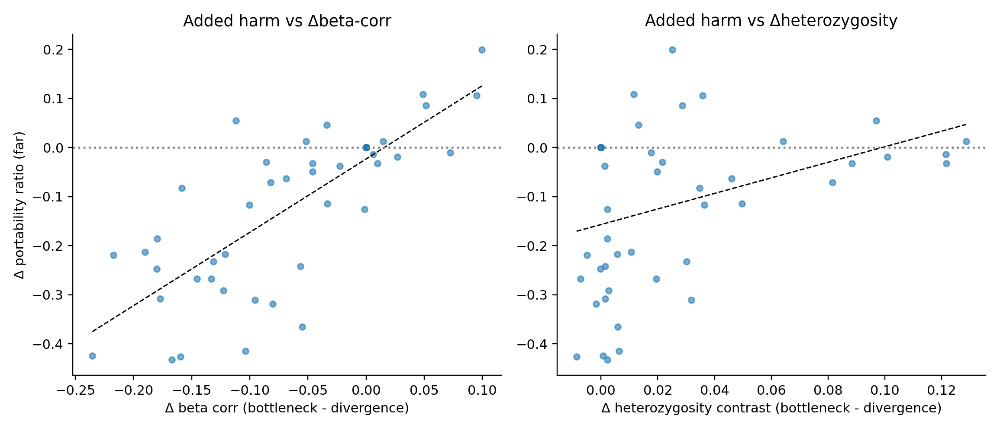

# LD Tagging vs Heterozygosity: A Causal Mechanism Study of Portability Loss

## Executive Summary

We tested whether portability loss in these two-population simulations is driven mainly by **LD-tagging transfer failure** or by **heterozygosity/variance shifts**. The design explicitly rules out simple overfitting by evaluating portability as `R²(pop1) / R²(pop0-holdout)` with a fixed POP0 training set.

Main findings:

1. Portability loss appears quickly after divergence: by **50 generations**, far-tag portability is already below 1 with 95% CI excluding 1 in both scenarios.

2. Far tags (50-250 kb from causal variants) lose portability much faster than near tags (<=5 kb), consistent with an LD-tagging mechanism.

3. Causal intervention shows asymmetry: heterozygosity-neutralized scoring changes portability only slightly (`+0.0017` on average), while LD destruction in POP1 collapses portability (`-0.3885` on average).

4. Bottleneck adds extra harm beyond simple divergence; that added harm tracks beta-transfer mismatch more strongly (`corr=0.776`) than heterozygosity shift (`corr=0.368`).

Conclusion: in this setup, the dominant mechanism is **LD-tagging transfer failure**, with heterozygosity effects present but secondary.

## Scientific Question

When a bottlenecked training ancestry is used to build PRS, why does performance transfer worsen in another ancestry? Is the additional loss primarily due to **LD-tag mismatch** (tag effects learned in training do not transfer), or due to **heterozygosity/allele-frequency scaling differences** at PRS sites?

## Experimental Design

### Simulation setup

- Simulator: `msprime` (Hudson model)

- Genome: 5 Mb, mutation and recombination rates `1e-8`

- Populations: two-pop model with either `divergence` or `bottleneck`

- Divergence generations: `0, 50, 100, 500, 1000, 5000`

- Replicates: 8 seeds per condition

- Sample size: 1600 diploids per population

- Trait architecture: 400 causal variants, `h2=0.5`, prevalence `0.1`

### PRS construction and anti-overfitting control

- Train PRS betas only in `POP0-train` using marginal regression against `G_true`.

- Evaluate on `POP0-test` (same-ancestry holdout) and `POP1` (cross-ancestry target).

- Portability metric: `R²(POP1) / R²(POP0-test)`.

- Null PRS (permuted train labels) R² is near zero: `POP0-test=0.0124`, `POP1=0.0074`.

### Mechanism-focused interventions

1. **Near-vs-far tag panels**: near tags (<=5 kb) vs far tags (50-250 kb), with MAF matching to reduce heterozygosity confounding.

2. **Heterozygosity-neutralized scoring**: for POP1 only, standardize far tags with POP1 moments before applying POP0-trained betas.

3. **LD-destroy intervention**: permute POP1 far-tag genotypes site-wise to preserve MAF/heterozygosity while destroying LD.

## Results

### 1) Portability emerges quickly

At generation 0, far-tag portability is near 1 (divergence `1.013` [0.972, 1.053], bottleneck `1.013` [0.972, 1.053]).

By generation 50, portability drops strongly (divergence `0.679` [0.634, 0.724], bottleneck `0.424` [0.347, 0.502]).

This identifies an early emergence point (around 50 generations) in this parameter regime.

### 2) Distance-to-causal manipulation supports LD tagging

At 5000 generations, near tags remain substantially more portable than far tags: divergence near `0.256` vs far `0.039`, bottleneck near `0.195` vs far `0.028`.

Predictions tied to local LD transfer better than long-range tagging, as expected under an LD-tag mechanism.

### 3) Causal intervention separates LD from heterozygosity

Heterozygosity-neutralized scoring changes portability only slightly (`+0.0017`), while LD destruction has a large negative effect (`-0.3885`).

So preserving heterozygosity is not enough to preserve transfer; preserving LD structure is critical.

### 4) Why bottleneck adds extra harm

Across matched seed-generation pairs, added bottleneck harm in far portability averages `-0.116` and correlates more with beta-transfer mismatch (`0.776`) than with heterozygosity shift (`0.368`).

This supports the view that bottleneck hurts mostly by worsening transfer of learned tag effects.

## Bottom-Line Conclusion

In these simulations, portability loss is causally dominated by **LD tagging transfer failure**. Heterozygosity effects exist but are secondary in magnitude for this setup.

## Reproducibility

Script: `/Users/user/gnomon/agents/portability_results/ld_vs_hetero_causal.py`

Data: `/Users/user/gnomon/agents/portability_results/ld_vs_hetero_causal/ld_vs_hetero_results.csv`
