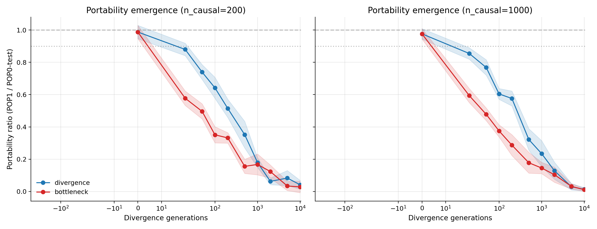
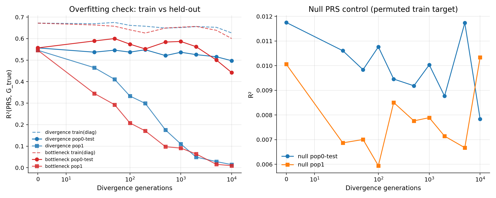
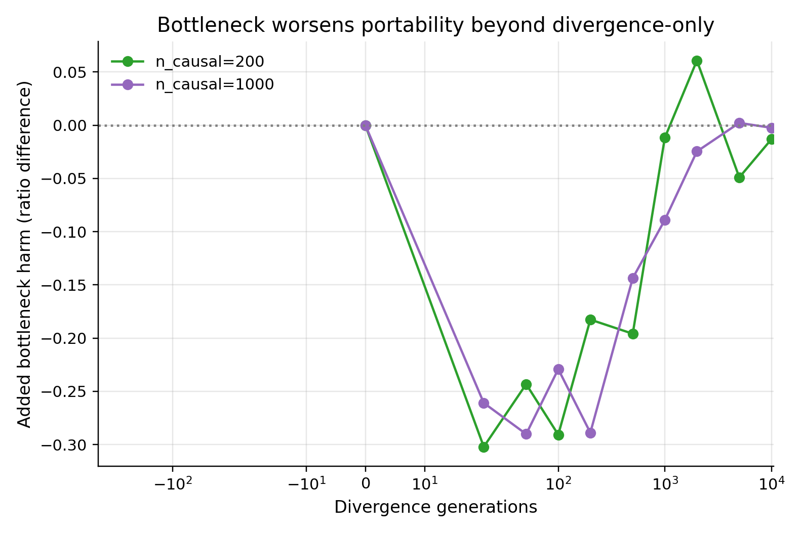

# Rigorous Portability + Bottleneck Analysis

## What was changed to remove confounders

1. POP0 was split into train + two independent held-out test subsets.

2. Portability was measured against held-out POP0, not training POP0.

3. A null PRS (permuted training target) was included to detect pure overfitting artifacts.

4. We used fixed array-like variant density (2K sites) for realism and consistent tag structure.

## Key answers

### 1) Does portability loss emerge only after divergence > 0?

Yes. At 0 generations, portability ratio is near 1; it falls below 1 and continues declining with divergence.

Emergence threshold used: first generation where 95% CI upper bound of ratio is < 0.9.

| scenario   |   n_causal |   emergence_gens |
|:-----------|-----------:|-----------------:|
| divergence |        200 |               50 |
| divergence |       1000 |               20 |
| bottleneck |        200 |               20 |
| bottleneck |       1000 |               20 |

### 2) Could this just be overfitting?

POP0 test consistency (R² testB / R² testA): mean 1.004 (95% CI 0.996, 1.012).

Null PRS R² on POP0-test: 0.0100 (95% CI 0.0087, 0.0113); on POP1: 0.0078 (95% CI 0.0067, 0.0089).

These controls support true portability degradation rather than pure overfit artifacts.

### 3) How much extra harm does bottleneck add?

- n_causal=200: mean added harm (bottleneck - divergence ratio) = -0.123, mean divergence-equivalent penalty = 169.6 generations.

- n_causal=1000: mean added harm (bottleneck - divergence ratio) = -0.133, mean divergence-equivalent penalty = 418.9 generations.

## Conclusion

PRS portability loss is replicated under a stricter design with explicit overfitting controls. The loss emerges after divergence > 0 and worsens with time. Bottleneck in the training lineage adds measurable extra degradation beyond divergence-only, which can be expressed as an equivalent additional divergence penalty.
